# Intelligence Engine

> AST-driven code knowledge graphs with hybrid search -- Kuzu graph + LanceDB vectors + BM25 full-text across 54 indexed projects.

[](https://github.com/fbratten/intelligence-engine)
[]()
[](https://opensource.org/licenses/MIT)
[]()
[](https://fbratten.github.io/intelligence-engine-showcase/)

---

## What It Does

- **Parses source code into knowledge graphs** -- functions, classes, methods, modules, and interfaces become queryable graph entities with full relationship mapping
- **Hybrid search across three strategies** -- BM25 keyword matching, semantic vector search via LanceDB, and graph context expansion work together to find exactly what you need
- **Interactive graph visualization** -- Sigma.js force-directed layouts let you explore code relationships visually, with filtering, zoom, and entity detail panels
- **AI-powered analysis** -- Entity summarization, natural language Q&A, batch analysis, and wiki generation powered by Claude, OpenAI, Gemini, or Ollama

---

## Key Capabilities

| Capability | Description |
|------------|-------------|
| **AST Parsing** | 6 languages supported: Python, JavaScript, TypeScript, TSX, Java, Go |
| **Knowledge Graph** | KuzuDB-backed graph with full Cypher query support |
| **Hybrid Search** | Triple-strategy: BM25 keyword + semantic vector + graph context expansion |
| **Cross-Project Search** | Shared KuzuDB mode indexes 54 projects in a single queryable graph |
| **Code Quality Metrics** | Cyclomatic complexity, documentation coverage, coupling analysis, fan-in/fan-out |
| **Health Analysis** | Dead code detection, circular dependency finder, hub identification |
| **Change Impact** | Blast radius calculation -- see every downstream caller affected by a change |
| **AI Summarization** | Multi-provider support: Claude, OpenAI, Gemini, Ollama |
| **Wiki Generation** | Auto-generate documentation from graph structure |
| **Memory System** | Unified KuzuDB graph + Minna memories for persistent knowledge |
| **33 Cypher Templates** | Pre-built queries for common analysis patterns |
| **Incremental Indexing** | Git diff-based updates -- only re-index what changed |

---

## MCP Tools

Intelligence Engine exposes 15 tools via the Model Context Protocol:

| Tool | Description |
|------|-------------|
| `ie_index` | Index a project -- parse source code into the knowledge graph |
| `ie_status` | Check indexing status for a project |
| `ie_search_all` | Cross-project hybrid search across all indexed projects |
| `ie_query` | Search within a single project using hybrid strategies |
| `ie_context` | Get full context for an entity -- callers, callees, blast radius |
| `ie_cypher` | Run arbitrary Cypher queries against the knowledge graph |
| `ie_quality` | Run code quality analysis -- complexity, docs, coupling metrics |
| `ie_health` | Health check -- dead code, cycles, hubs, concentration |
| `ie_detect_changes` | Detect changes since last index and calculate impact |
| `ie_summarize` | AI-powered entity summarization |
| `ie_batch_summarize` | Batch summarize multiple entities |
| `ie_global_analysis` | Cross-project analysis and pattern detection |
| `ie_wiki` | Generate wiki documentation from graph |
| `ie_memory` | Store and retrieve persistent memories |
| `ie_context` | Get recent context and session state |

---

## Web UI

The React 18 + TypeScript frontend provides 13 interactive components:

| Component | Purpose |
|-----------|---------|
| **Project Picker** | Select from 54 indexed projects |
| **Search Bar** | Hybrid search with strategy selection (BM25, semantic, graph) |
| **Graph Canvas** | Sigma.js 3.0 force-directed visualization of code relationships |
| **Filter Panel** | Filter by entity type, language, complexity, connectivity |
| **Entity Detail** | Full entity view with metadata, source code, and relationships |
| **History Panel** | Navigation history and bookmarks |
| **Source Panel** | Syntax-highlighted source code with CodeMirror 6 |
| **Dashboard** | 6 tabs: Overview, Quality, Health, Dependencies, AI Insights, Memory |
| **Cypher Console** | CodeMirror 6 editor with 33 pre-built query templates |
| **Settings** | Configuration for AI providers, display, and search behavior |
| **Batch Summarize** | Queue and run AI summarization across multiple entities |
| **Color Legend** | Visual key for entity types and relationship categories |
| **Status Bar** | Live indexing progress, connection status, search metrics |

---

## Architecture

<div style="background: #0d1117; border-radius: 12px; padding: 24px; font-family: monospace; color: #c9d1d9; max-width: 800px;">

  <!-- Frontend Layer -->
  <div style="background: #1a1e2e; border: 2px solid #58a6ff; border-radius: 8px; padding: 16px; margin-bottom: 16px;">
    <div style="color: #58a6ff; font-weight: bold; font-size: 14px; margin-bottom: 8px;">Frontend -- React 18 + TypeScript</div>
    <div style="display: flex; gap: 8px; flex-wrap: wrap;">
      <span style="background: #21262d; border: 1px solid #30363d; border-radius: 4px; padding: 4px 10px; color: #79c0ff; font-size: 12px;">Sigma.js 3.0 Graph</span>
      <span style="background: #21262d; border: 1px solid #30363d; border-radius: 4px; padding: 4px 10px; color: #79c0ff; font-size: 12px;">CodeMirror 6 Cypher</span>
      <span style="background: #21262d; border: 1px solid #30363d; border-radius: 4px; padding: 4px 10px; color: #79c0ff; font-size: 12px;">Search Bar</span>
      <span style="background: #21262d; border: 1px solid #30363d; border-radius: 4px; padding: 4px 10px; color: #79c0ff; font-size: 12px;">Dashboard (6 tabs)</span>
      <span style="background: #21262d; border: 1px solid #30363d; border-radius: 4px; padding: 4px 10px; color: #79c0ff; font-size: 12px;">Entity Detail</span>
      <span style="background: #21262d; border: 1px solid #30363d; border-radius: 4px; padding: 4px 10px; color: #79c0ff; font-size: 12px;">Filter Panel</span>
    </div>
  </div>

  <!-- Arrow -->
  <div style="text-align: center; color: #8b949e; font-size: 18px; margin: 4px 0;">&#8595;&#8593; REST API (30+ endpoints)</div>

  <!-- API Layer -->
  <div style="background: #1a2e1a; border: 2px solid #3fb950; border-radius: 8px; padding: 16px; margin: 16px 0;">
    <div style="color: #3fb950; font-weight: bold; font-size: 14px; margin-bottom: 8px;">REST API -- FastAPI (port 8420)</div>
    <div style="display: flex; gap: 8px; flex-wrap: wrap;">
      <span style="background: #21262d; border: 1px solid #30363d; border-radius: 4px; padding: 4px 10px; color: #7ee787; font-size: 12px;">Search Endpoints</span>
      <span style="background: #21262d; border: 1px solid #30363d; border-radius: 4px; padding: 4px 10px; color: #7ee787; font-size: 12px;">Graph Queries</span>
      <span style="background: #21262d; border: 1px solid #30363d; border-radius: 4px; padding: 4px 10px; color: #7ee787; font-size: 12px;">Analysis APIs</span>
      <span style="background: #21262d; border: 1px solid #30363d; border-radius: 4px; padding: 4px 10px; color: #7ee787; font-size: 12px;">MCP Server (15 tools)</span>
      <span style="background: #21262d; border: 1px solid #30363d; border-radius: 4px; padding: 4px 10px; color: #7ee787; font-size: 12px;">AI Providers</span>
      <span style="background: #21262d; border: 1px solid #30363d; border-radius: 4px; padding: 4px 10px; color: #7ee787; font-size: 12px;">Wiki Generator</span>
    </div>
  </div>

  <!-- Arrow -->
  <div style="text-align: center; color: #8b949e; font-size: 18px; margin: 4px 0;">&#8595;&#8593;</div>

  <!-- Backend Layer -->
  <div style="background: #2e1a2e; border: 2px solid #bc8cff; border-radius: 8px; padding: 16px;">
    <div style="color: #bc8cff; font-weight: bold; font-size: 14px; margin-bottom: 8px;">Backend -- Storage + Analysis</div>
    <div style="display: flex; gap: 8px; flex-wrap: wrap;">
      <span style="background: #21262d; border: 1px solid #30363d; border-radius: 4px; padding: 4px 10px; color: #d2a8ff; font-size: 12px;">KuzuDB Graph</span>
      <span style="background: #21262d; border: 1px solid #30363d; border-radius: 4px; padding: 4px 10px; color: #d2a8ff; font-size: 12px;">LanceDB Vectors</span>
      <span style="background: #21262d; border: 1px solid #30363d; border-radius: 4px; padding: 4px 10px; color: #d2a8ff; font-size: 12px;">BM25 Full-Text</span>
      <span style="background: #21262d; border: 1px solid #30363d; border-radius: 4px; padding: 4px 10px; color: #d2a8ff; font-size: 12px;">AST Parsers (6 langs)</span>
      <span style="background: #21262d; border: 1px solid #30363d; border-radius: 4px; padding: 4px 10px; color: #d2a8ff; font-size: 12px;">Complexity Analyzer</span>
      <span style="background: #21262d; border: 1px solid #30363d; border-radius: 4px; padding: 4px 10px; color: #d2a8ff; font-size: 12px;">Git Diff Engine</span>
    </div>
  </div>

</div>

---

## Real-World Use Cases

### Multi-Agent Dev Cycle

Multiple AI agents use Intelligence Engine as their shared knowledge backbone during a development sprint. Agent A indexes new code after each commit. Agent B searches for related implementations before writing new features. Agent C runs health checks to catch dead code and circular dependencies. Agent D queries blast radius before refactoring shared utilities. The knowledge graph becomes the single source of truth that keeps all agents aligned without direct coordination.

### Test Coverage Gap Discovery

After adding code to a project, run `ie_cypher` to find functions without test coverage. Query for functions with high cyclomatic complexity but no test file callers. Intelligence Engine becomes a capability "enlightener" -- surfacing blind spots that traditional coverage tools miss because it understands the *structural* relationship between production code and test code through the graph.

### Post-Merge Impact Analysis

After a large PR merge, use `ie_detect_changes` to calculate blast radius. Which 47 downstream callers are affected? Which tests need to run? Intelligence Engine answers in milliseconds what would take a human hours of manual code tracing. The graph knows every call chain, every import, every inheritance relationship.

### Cross-Project Dependency Audit

Using `ie_search_all` in shared mode, find every project that imports a specific utility. When updating a shared library, know exactly who depends on it across all 54 indexed projects. No more grep across dozens of repos -- the knowledge graph already has the complete dependency picture.

---

## Example Outputs

### Code Quality Analysis (`ie_quality`)

```
Project: agent-comm
━━━━━━━━━━━━━━━━━━━━━━━━━━━━━━━━━━━━━━━━

Composite Score:  69.1 / 100

Complexity
  Min:     1
  Max:     43
  Average: 1.6
  Median:  1

Documentation Coverage
  39.6% (181 / 457 entities documented)

Function Length
  Min:     2 lines
  Max:     328 lines
  Average: 12.1 lines

Top Complex Functions
  main()  CC = 43
```

### Health Analysis (`ie_health`)

```
Project: agent-comm
━━━━━━━━━━━━━━━━━━━━━━━━━━━━━━━━━━━━━━━━

Dead Code:              239 entities
Circular Dependencies:  0
Hub Count:              5
Hub Concentration:      0.724
Max Fan-Out:            main() → 44 connections
```

### Entity Context (`ie_context`)

```
Entity: MessageSpool
━━━━━━━━━━━━━━━━━━━━━━━━━━━━━━━━━━━━━━━━

Direct Callers:  3
Blast Radius:    6 entities across 2 depth levels

Used By:
  ├── SQLiteTransport
  ├── relay_server
  └── test_spool
```

### Cypher Query -- Inheritance Hierarchies (`ie_cypher`)

```cypher
MATCH (child)-[:INHERITS]->(parent)
RETURN parent.name, child.name
```

```
LLM Providers:
  ├── ClaudeProvider    → LLMProvider
  ├── OpenAIProvider    → LLMProvider
  ├── GeminiProvider    → LLMProvider
  └── OllamaProvider   → LLMProvider

Transports:
  ├── FileTransport     → Transport
  ├── HTTPTransport     → Transport
  └── SQLiteTransport   → Transport

Bridges:
  ├── OpenClawBridge       → Bridge
  └── OpenClawDirectBridge → Bridge
```

---

## Screenshots

### Graph Visualization

The main view -- a force-directed graph of all code entities in a project. Each node is a function, class, method, module, or variable. Edges show CALLS, IMPORTS, EXTENDS, DEFINES, and METHOD_OF relationships.

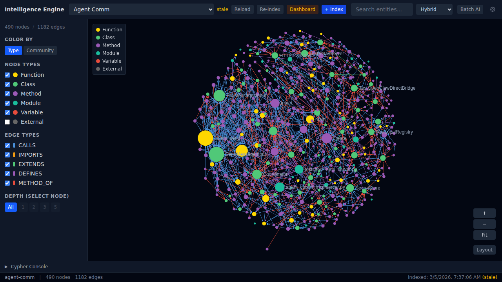
*Agent Comm project: 490 nodes, 1182 edges. Color-coded by entity type.*

### Community Detection

Switch to Community coloring to reveal tightly-connected clusters. The modularity score measures how well the code separates into distinct modules.

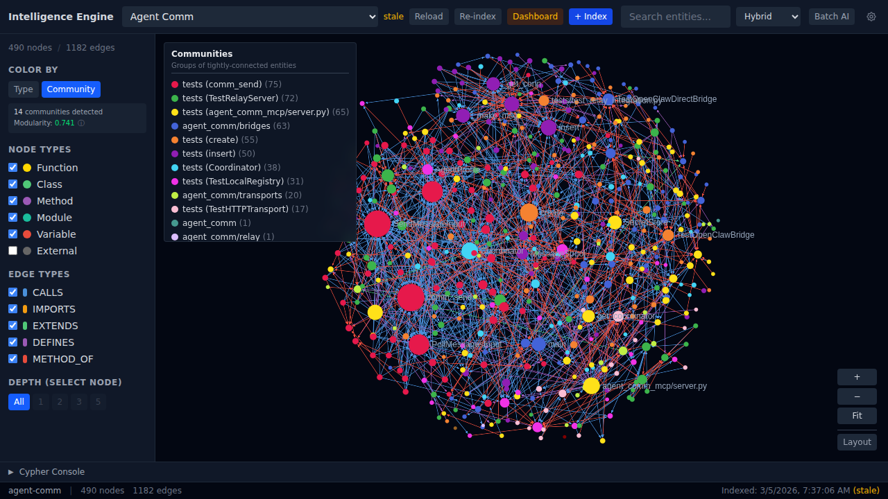
*14 communities detected with 0.741 modularity. Clusters map to architectural boundaries.*

### Entity Detail Panel

Click any node to see its full context -- file location, docstring, AI analysis buttons, caller/callee lists, source code, and Q&A history.

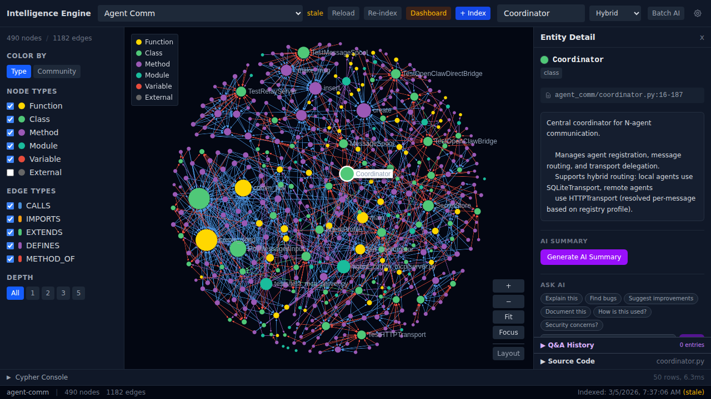
*Coordinator class: file path, docstring, Ask AI buttons (Explain, Find bugs, Suggest improvements, Document, Security concerns).*

### Source Code Viewer

Expand the Source Code section to see syntax-highlighted code with line numbers, directly from the indexed source files.

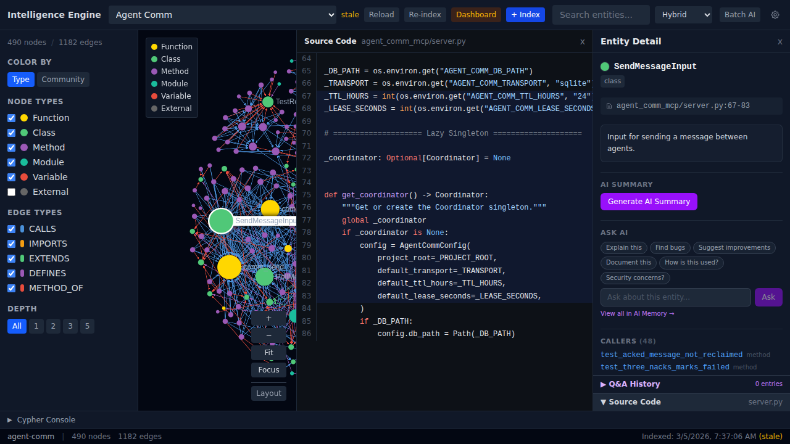
*Inline source viewer with syntax highlighting -- no need to switch to an IDE.*

### Depth-Filtered Subgraph

Select a node and set depth=1 to see only its immediate connections. Depth 2, 3, or 5 expand the neighborhood progressively.

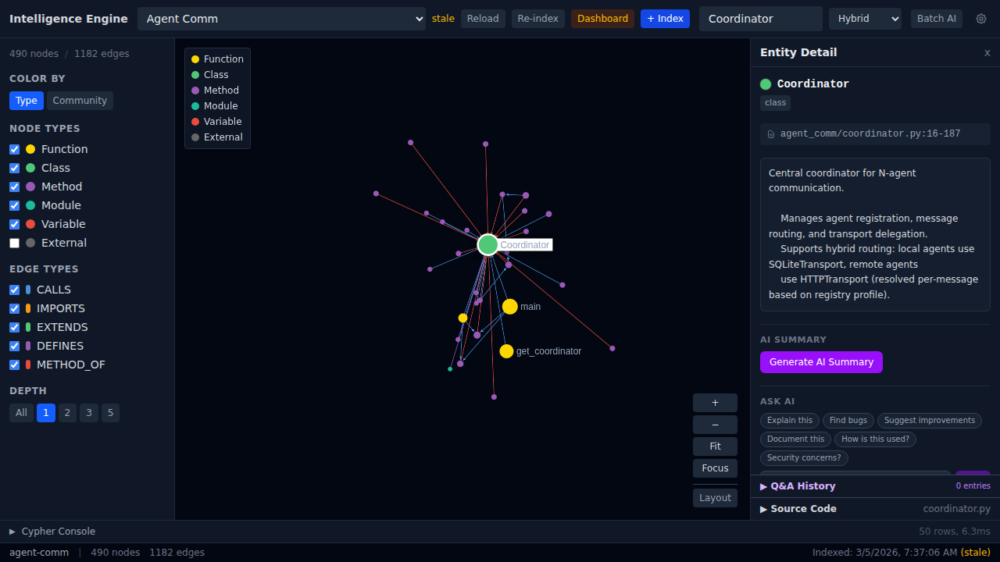
*Coordinator class at depth=1 -- showing direct callers, methods, and imports.*

### Hybrid Search

Search across entities using three combined strategies -- BM25 keyword matching, semantic vector similarity, and graph context expansion.

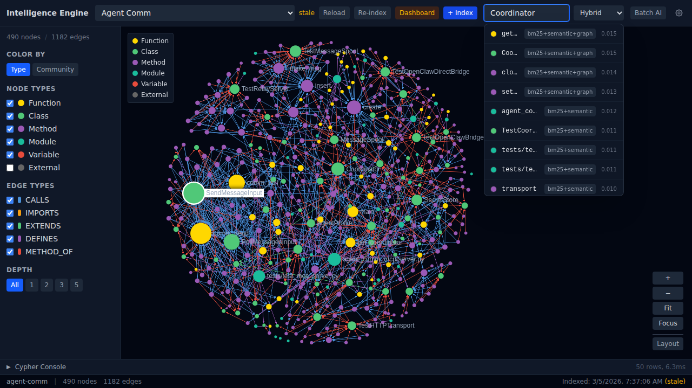
*Search for "Coordinator" returns ranked results with search strategy tags and relevance scores.*

### Dashboard -- Timeline & Phases

Track indexing history and see the breakdown of each indexing run by phase (parse, graph, BM25, semantic).

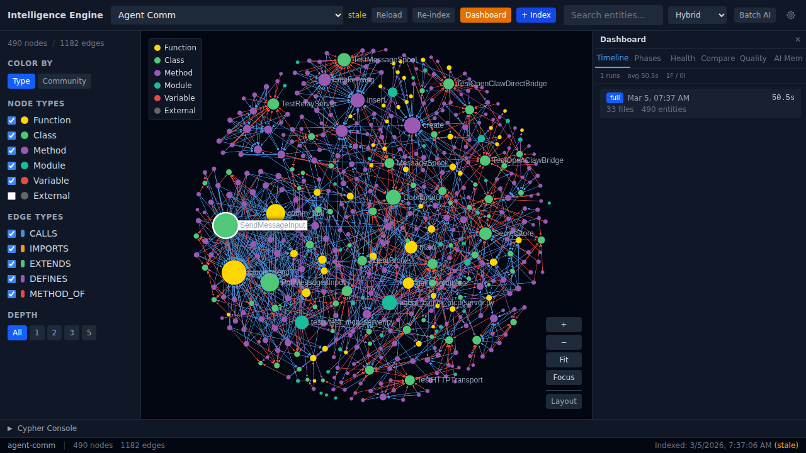
*Timeline tab: 1 run, 50.5s average, 33 files, 490 entities.*

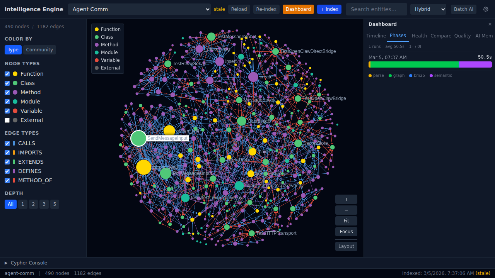
*Phase breakdown showing time spent in each indexing stage.*

### Dashboard -- Health

At-a-glance structural health metrics: dead code count, circular dependencies, and hub concentration.

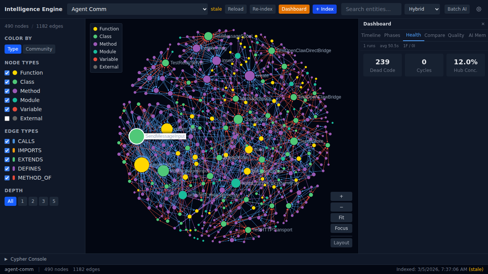
*239 dead code entities, 0 cycles, 12.0% hub concentration.*

### Dashboard -- Quality

Composite quality score with complexity distribution, most complex functions, and documentation coverage progress.

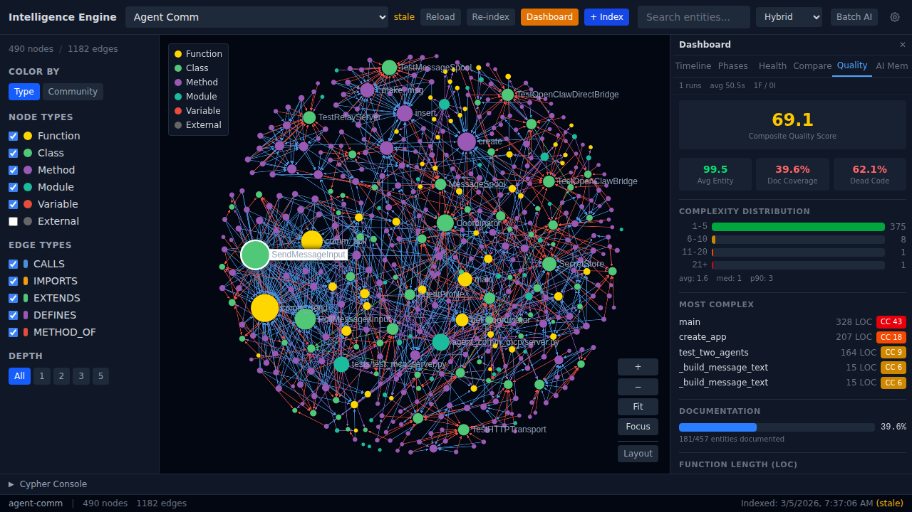
*Score 69.1/100. Complexity distribution bar chart. main() at CC 43. 39.6% doc coverage.*

### Dashboard -- Cross-Project Compare

Side-by-side comparison of all indexed projects -- files, entities, indexing time, and dead code counts.

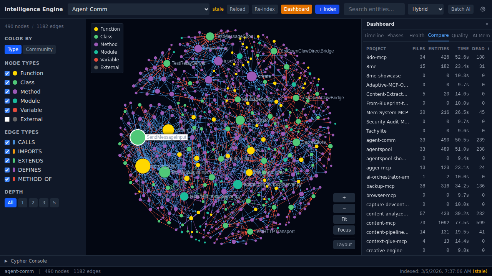
*Compare tab spanning all 54 indexed projects.*

### Dashboard -- AI Memory Browser

Unified memory browser showing KuzuDB graph knowledge and Minna persistent memories, with search and export.


*AI Memory tab with All/KuzuDB/Minna source filters, search, and JSON/CSV export.*

### Cypher Console

Built-in Cypher query editor with pre-built templates and tabular results. Run arbitrary graph queries against the knowledge graph.

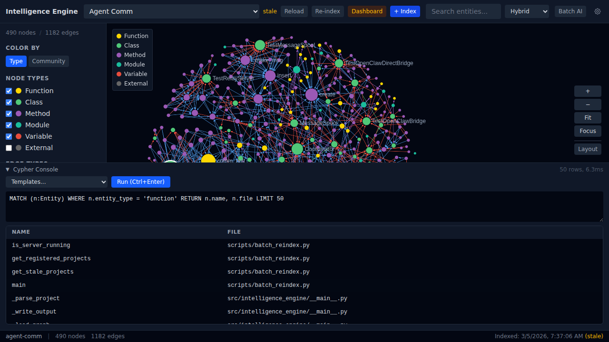
*Query: MATCH functions -- 50 rows in 6.3ms. Templates dropdown for common queries.*

### Node Type Filtering

Toggle entity types on/off to focus the graph on specific code structures.

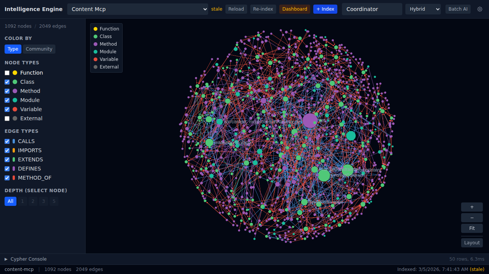
*Functions hidden -- only classes, methods, modules, and variables visible.*

### Search Mode Selection

Choose between Hybrid (all three), BM25-only, or Semantic-only search strategies.

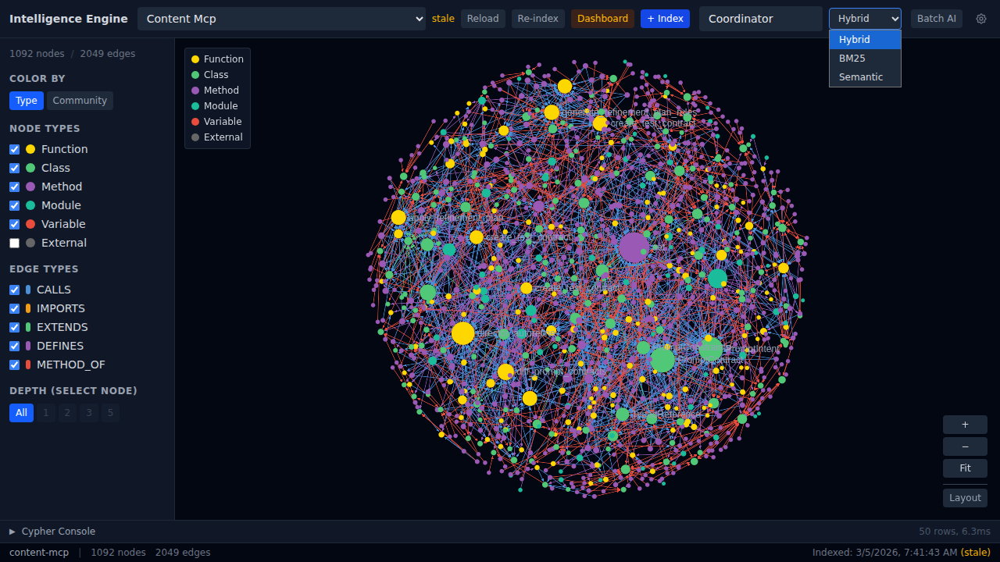
*Dropdown: Hybrid, BM25, Semantic.*

### LLM Provider Settings

Configure multiple AI providers for entity summarization and Q&A -- Claude, OpenAI, and Gemini.

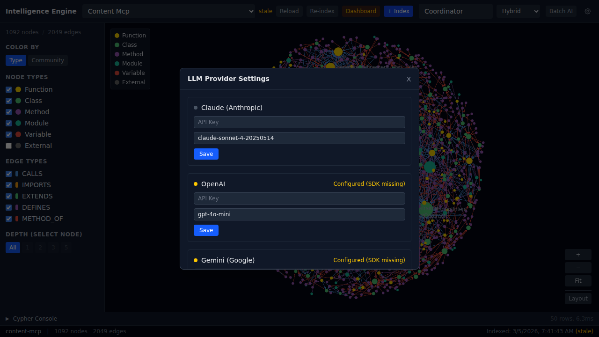
*Multi-provider configuration with API key management.*

### Project Selection

Browse and select from all indexed projects via the dropdown.

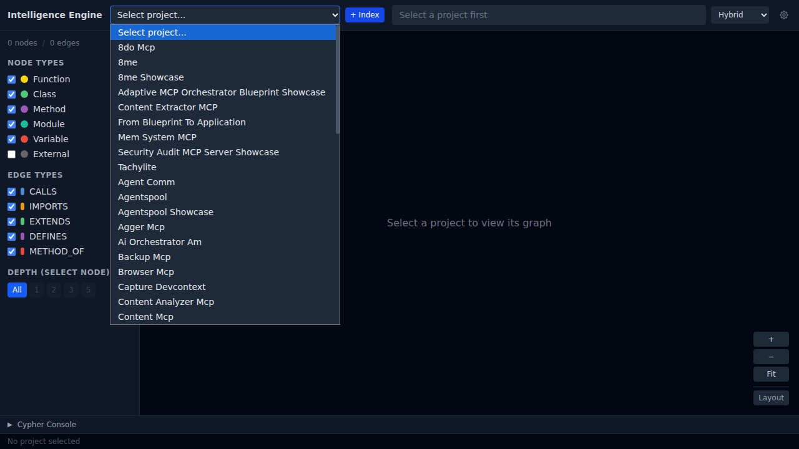
*54 indexed projects available for exploration.*

### Large Project Visualization

Content MCP at 1092 nodes and 2049 edges -- the graph handles large codebases smoothly.

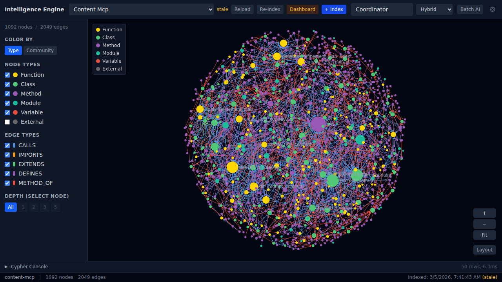
*Content MCP: 1092 nodes, 2049 edges. Dense but navigable.*

---

## Interactive Demos

<div style="display: grid; grid-template-columns: repeat(3, 1fr); gap: 16px; margin: 20px 0;">

  <a href="https://fbratten.github.io/intelligence-engine-showcase/demos/tool-selector/" style="text-decoration: none; display: block; background: #12122a; border: 2px solid #1a1a3e; border-radius: 4px; padding: 20px; transition: all 0.2s; text-align: center;">
    <div style="font-family: 'Press Start 2P', monospace; color: #00ffff; font-size: 11px; margin-bottom: 10px; text-shadow: 0 0 10px rgba(0,255,255,0.5);">TOOL SELECTOR</div>
    <div style="font-size: 32px; margin-bottom: 10px;">&#x1F578;</div>
    <div style="font-family: 'Share Tech Mono', monospace; color: #6a6a9a; font-size: 12px;">Find the right IE tool for your task</div>
  </a>

  <a href="https://fbratten.github.io/intelligence-engine-showcase/demos/search-strategy-picker/" style="text-decoration: none; display: block; background: #12122a; border: 2px solid #1a1a3e; border-radius: 4px; padding: 20px; transition: all 0.2s; text-align: center;">
    <div style="font-family: 'Press Start 2P', monospace; color: #ff00ff; font-size: 11px; margin-bottom: 10px; text-shadow: 0 0 10px rgba(255,0,255,0.5);">SEARCH PICKER</div>
    <div style="font-size: 32px; margin-bottom: 10px;">&#x1F50D;</div>
    <div style="font-family: 'Share Tech Mono', monospace; color: #6a6a9a; font-size: 12px;">Compare BM25, Semantic & Hybrid strategies</div>
  </a>

  <a href="https://fbratten.github.io/intelligence-engine-showcase/demos/search-picker/" style="text-decoration: none; display: block; background: #12122a; border: 2px solid #1a1a3e; border-radius: 4px; padding: 20px; transition: all 0.2s; text-align: center;">
    <div style="font-family: 'Press Start 2P', monospace; color: #39ff14; font-size: 11px; margin-bottom: 10px; text-shadow: 0 0 10px rgba(57,255,20,0.5);">QUERY GUIDE</div>
    <div style="font-size: 32px; margin-bottom: 10px;">&#x1F916;</div>
    <div style="font-family: 'Share Tech Mono', monospace; color: #6a6a9a; font-size: 12px;">Interactive decision tree for search queries</div>
  </a>

</div>

---

## Quick Start

```bash
# Clone and set up
cd ~/projects/intelligence-engine
python -m venv .venv && source .venv/bin/activate
pip install -r requirements.txt

# Start the API server (port 8420)
python -m intelligence_engine.api

# Index your first project
curl -X POST http://localhost:8420/api/index \
  -H "Content-Type: application/json" \
  -d '{"project_path": "/path/to/your/project"}'

# Start the frontend
cd src/intelligence_engine/web/frontend
npm install
npm run dev
```

---

## Links

- **GitHub:** [fbratten/intelligence-engine](https://github.com/fbratten/intelligence-engine)
- **Live Showcase:** [fbratten.github.io/intelligence-engine-showcase](https://fbratten.github.io/intelligence-engine-showcase/)
- **License:** MIT

---

<sub>Intelligence Engine v0.19.1 -- 958 tests passing, 54 projects indexed, 6 languages supported.</sub>
