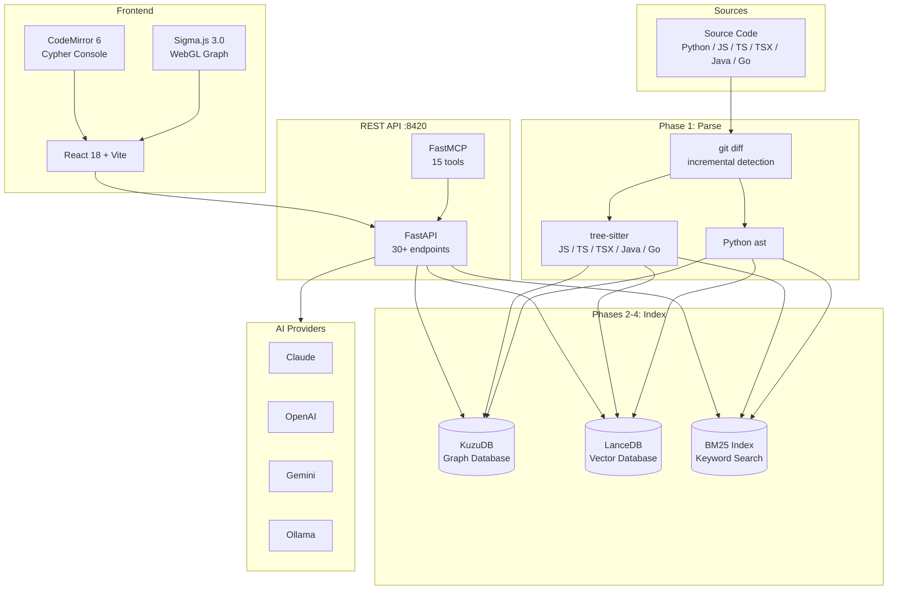

# Architecture

Intelligence Engine is a multi-layer system that parses source code into a searchable graph, augmented with semantic embeddings and full-text indexing. This document describes each layer and how data flows between them.

---

## Frontend (React 18 + TypeScript)

The UI is a single-page React 18 application bundled with **Vite**.

**Graph Rendering** -- Sigma.js 3.0 drives an interactive force-directed graph layout rendered via WebGL. Nodes represent code entities; edges represent relationships (calls, imports, inheritance).

**Cypher Console** -- CodeMirror 6 provides syntax-highlighted editing for Cypher queries issued directly against the graph database.

### Component Tree

```
App
├── GraphCanvas          # Sigma.js WebGL canvas, force-directed layout
├── Sidebar              # Navigation, project selector, filters
├── EntityDetail         # Inspector panel for selected node
├── Dashboard            # 6 tabs: Overview, Quality, Dependencies, Complexity, Coverage, AI
├── CypherConsole        # CodeMirror 6 editor + result table
├── SearchBar            # Unified search (graph, semantic, keyword)
└── Settings             # Provider config, theme, indexing controls
```

Vite serves the dev build with HMR and proxies API requests to the FastAPI backend.

---

## REST API (FastAPI, port 8420)

The backend exposes 30+ endpoints organised into route groups:

| Route Group | Purpose |
|---|---|
| `/api/projects` | Project CRUD, indexing triggers, project metadata |
| `/api/search` | Unified search across graph, vector, and BM25 |
| `/api/graph` | Node/edge queries, subgraph extraction, Cypher pass-through |
| `/api/quality` | Code quality metrics, complexity scores, issue detection |
| `/api/health` | Liveness, readiness, storage stats |
| `/api/ai` | AI-powered summarisation, explanation, suggestions |
| `/api/wiki` | Auto-generated documentation pages per entity |
| `/api/memory` | Session memory, context retrieval |

### MCP Server

The API also exposes 15 tools via **FastMCP**, making the engine callable as an MCP tool provider. MCP clients (including Claude Code) can invoke search, indexing, graph queries, quality checks, and AI features through the standard MCP protocol.

---

## Storage Layer

Three complementary stores back the search and query capabilities:

### KuzuDB -- Graph Database

KuzuDB stores the code knowledge graph. All structural relationships live here.

**Node schema (`Entity`):**

| Property | Type | Description |
|---|---|---|
| `name` | string | Fully qualified entity name |
| `entity_type` | string | `function`, `class`, `method`, `module`, `variable`, `interface`, `external` |
| `file` | string | Source file path relative to project root |
| `line_start` | int | First line of the entity definition |
| `line_end` | int | Last line of the entity definition |
| `complexity` | int | Cyclomatic complexity score |
| `docstring` | string | Extracted documentation string |
| `project` | string | Owning project identifier |

**Edge types:**

| Edge | Meaning |
|---|---|
| `CALLS` | Function/method invokes another function/method |
| `IMPORTS` | Module imports another module or entity |
| `EXTENDS` | Class inherits from another class |
| `DEFINES` | Module defines a top-level entity |
| `METHOD_OF` | Method belongs to a class |

### LanceDB -- Vector Database

LanceDB stores dense vector embeddings for semantic search. Each indexed entity is embedded using the **all-MiniLM-L6-v2** sentence transformer (384-dimensional vectors). Queries are embedded at search time and matched via approximate nearest-neighbour lookup.

### BM25 Index -- Full-Text Keyword Search

A BM25 inverted index provides traditional keyword search over entity names, docstrings, and file paths. This complements semantic search for exact-match and partial-match queries where lexical precision matters.

---

## AST Parsing Pipeline

Source code is parsed into structured entities using language-appropriate AST parsers:

| Language | Parser |
|---|---|
| Python | `ast` (stdlib) |
| JavaScript | tree-sitter |
| TypeScript | tree-sitter |
| TSX | tree-sitter |
| Java | tree-sitter |
| Go | tree-sitter |

The parser extracts typed entities (`function`, `class`, `method`, `module`, `variable`, `interface`, `external`) along with their relationships, source locations, docstrings, and complexity metrics.

**Incremental indexing** -- On re-index, the pipeline runs `git diff` against the last indexed commit to identify changed files. Only modified files are re-parsed and their graph/vector/BM25 entries updated, avoiding full re-index overhead.

---

## AI Provider System

The AI features (summarisation, wiki generation, code explanation) support multiple LLM providers:

- **Claude** (Anthropic)
- **OpenAI** (GPT models)
- **Gemini** (Google)
- **Ollama** (local models)

Provider selection is configurable per-request or via project defaults. The abstraction layer normalises prompt formatting and response parsing across providers.

---

## Indexing Pipeline Phases

Indexing a project proceeds through four sequential phases:

| Phase | Action | Output |
|---|---|---|
| **1. Parse** | AST extraction per file using language-specific parsers | Entity and relationship records |
| **2. Graph** | Insert entities as nodes and relationships as edges into KuzuDB | Populated knowledge graph |
| **3. BM25** | Build inverted index over entity names, docstrings, file paths | Keyword search index |
| **4. Semantic** | Generate all-MiniLM-L6-v2 embeddings, insert into LanceDB | Vector search index |

Each phase is independently retriable. Incremental indexing (via `git diff`) applies at phase 1, and the delta propagates through subsequent phases.

---

## Data Flow



---

## Port Summary

| Service | Port | Protocol |
|---|---|---|
| Vite dev server | 5173 | HTTP |
| FastAPI backend | 8420 | HTTP |
| FastMCP (MCP tools) | via FastAPI | stdio / SSE |
