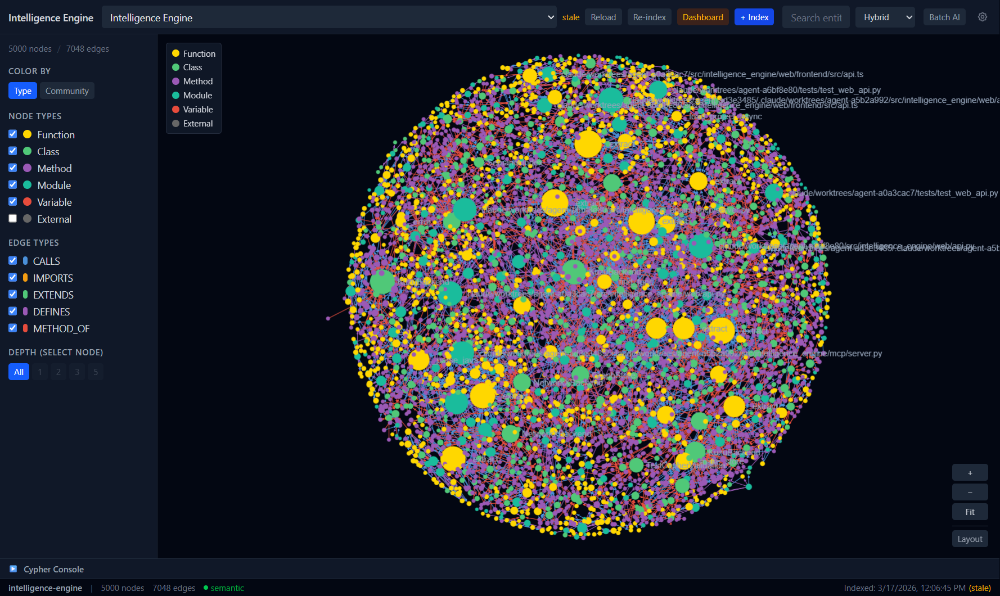
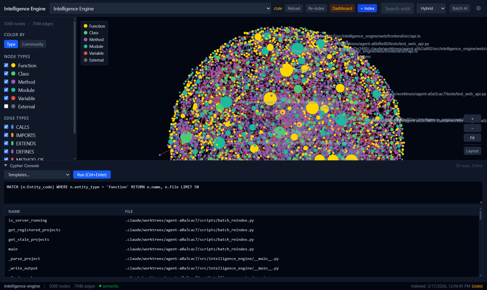
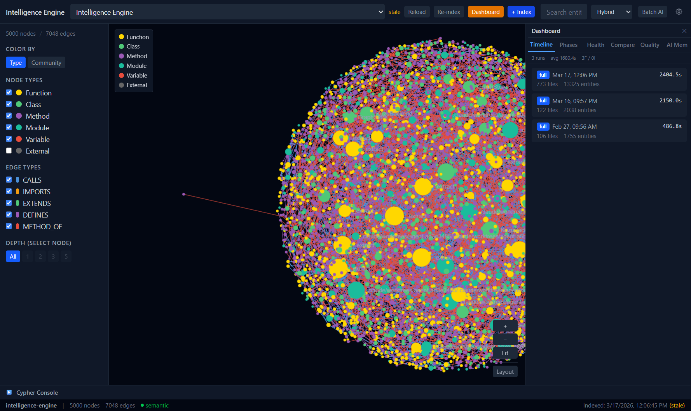
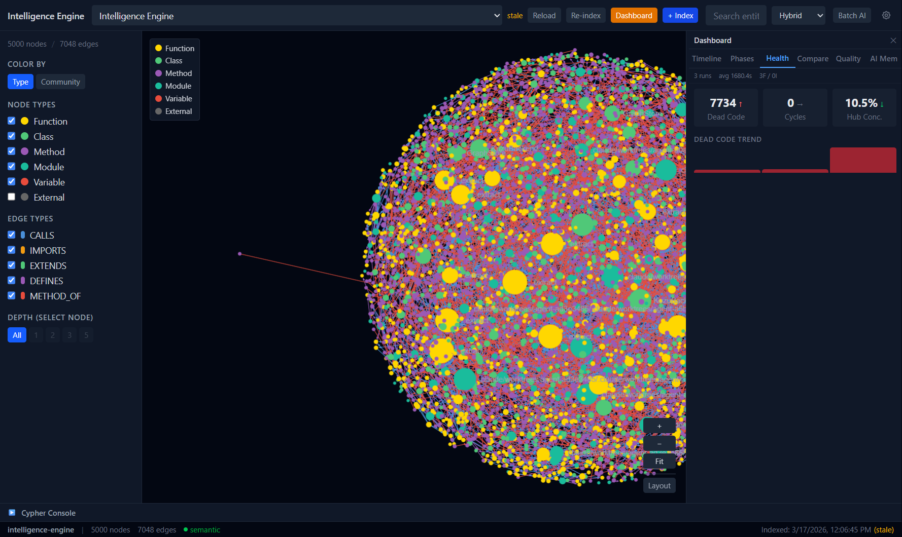
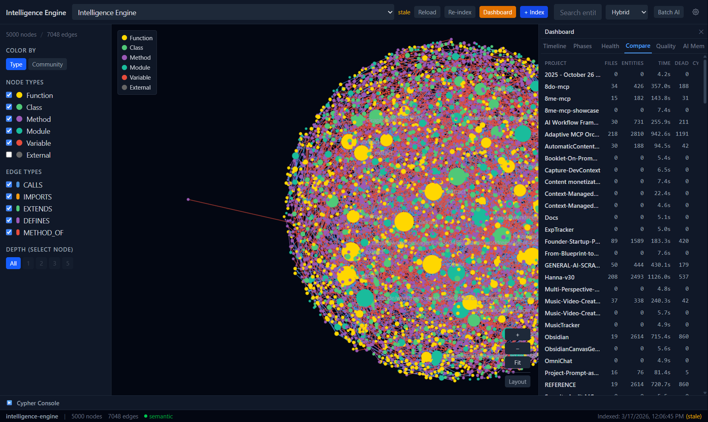
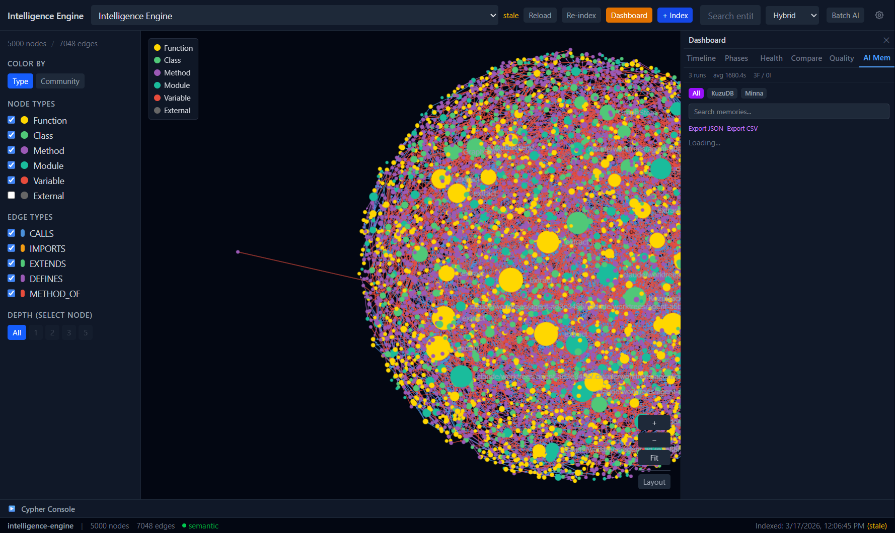
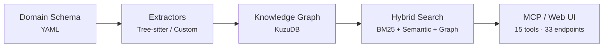

# Intelligence Engine

> Domain-agnostic intelligence engine with schema-driven knowledge graphs, hybrid search, and MCP server.

**1261+ Tests** · **15 MCP Tools** · **33 REST Endpoints** · **8 Languages** · **2 Domains**

---

## Screenshots

| | |
|---|---|
|  |  |
| **Knowledge Graph** — 5000 nodes, 7048 edges | **Cypher Console** — 50 rows in 9ms |
|  |  |
| **Dashboard Timeline** — indexing history | **Health Metrics** — dead code, cycles, hubs |
|  |  |
| **Cross-Project Compare** — all indexed projects | **AI Memory** — KuzuDB + Minna browser |

---

## Architecture

---

## Documentation

- [Architecture Deep-Dive](docs/architecture) — Domain schema system, pipeline, storage modes
- [Technical Overview](docs/technical-overview) — Parser, graph, search, AI, MCP, REST details
- [Architectural Decisions](docs/decisions) — Key design choices and rationale
- [Project Context](docs/project-context) — What it does, why it exists, status

---

## Interactive Demos

- [Which Search Strategy?](demos/search-picker/) — Choose the right search approach for your query

---

## Highlights

- Schema-driven domains: define entity types, relationships, and search profiles in YAML
- Code intelligence: 8 languages parsed via Tree-sitter (Python, JS, TS/TSX, Java, Go, HTML, CSS)
- Archaeology MVP: first non-code domain validates domain-agnostic architecture
- Hybrid search: 3-way RRF fusion (BM25 + semantic + graph)
- Graph visualization: React + Sigma.js force-directed explorer
- AI integration: summaries and Q&A via Claude, OpenAI, Gemini, Ollama
- MCP server: 15 tools for AI coding assistants
- Multi-project: shared DB mode with cross-project Cypher queries

---

[GitHub](https://github.com/fbratten/intelligence-engine-showcase)
